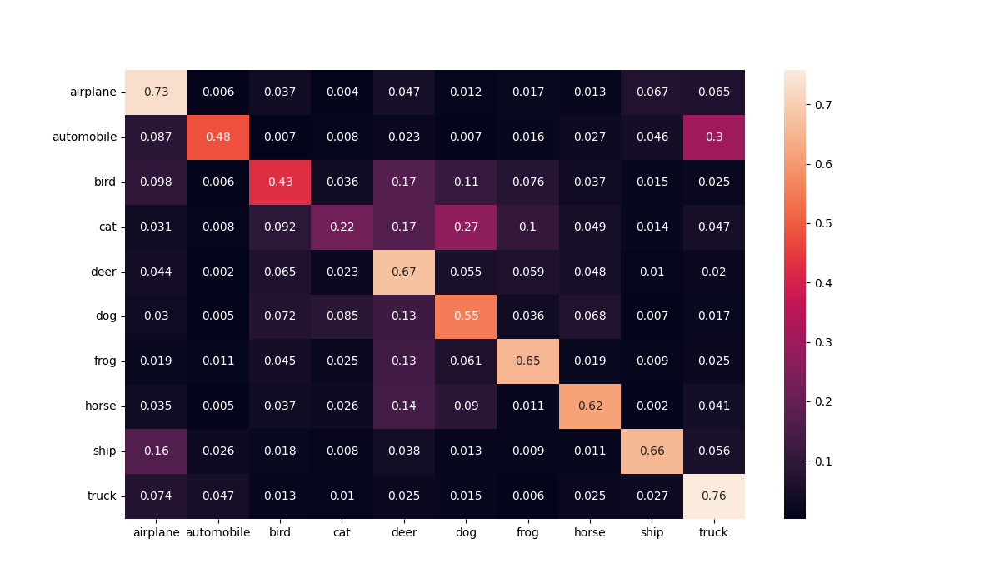

# CIFAR 10 ConvNN

Modelo convolucional para clasificación de imagenes en el dataset CIFAR-10

```python
class CnnModel(Module):
    def __init__(self):
        super(CnnModel, self).__init__()

        # Primer capa convolucional:
        self.conv1 = Conv2d(in_channels=3, out_channels=6,
                            kernel_size=5)
        self.maxpool1 = MaxPool2d(kernel_size=(2, 2))
        self.lrelu1 = LeakyReLU(0.01)

        # Segunda capa convolucional
        self.conv2 = Conv2d(in_channels=6, out_channels=18,
                            kernel_size=5)
        self.maxpool2 = MaxPool2d(kernel_size=(2,2))
        self.lrelu2 = LeakyReLU(0.01)


        # Capa de aprendizaje
        self.fc1 = Linear(in_features=450, out_features=225)
        self.lrelu3 = LeakyReLU(0.01)

        self.fc2 = Linear(in_features=225, out_features=115)
        self.lrelu4 = LeakyReLU(0.01)

        # Capa de clasificación
        self.fc3 = Linear(in_features=115, out_features=10)
        self.lsoftmax = LogSoftmax(dim=0)
```

## Resultados
