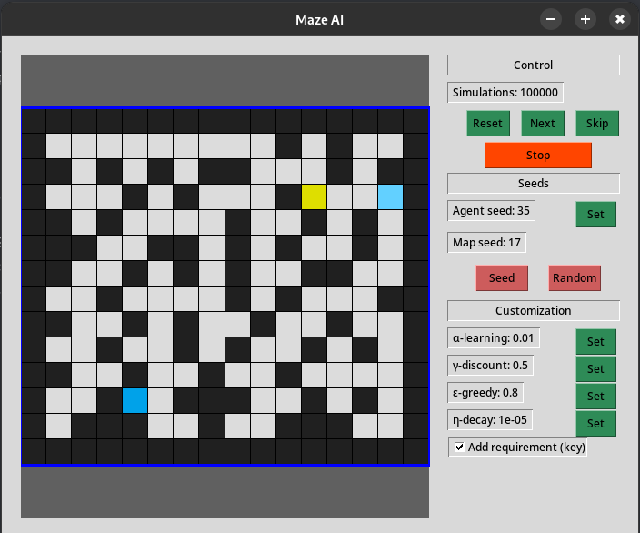
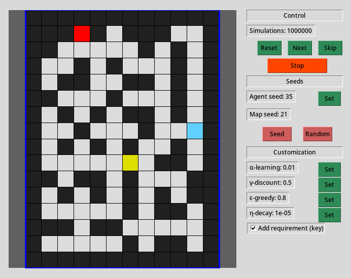

# Lab7 Q-learning

## Seed 17
Para el seed 17 buscar la llave no tiene gracia porque esta en el camino, es posible ajustar el valor de $\eta$ para obtener mejores resultados, pero una exploración más libre podría dar resultados mas interesantes y optimos, para este caso eso realmente no es muy interesante porque solo hay un camino entonces no hay que buscar un camino optimo.

## Seed 21
Usando $1000000$ de epocas en esta seed no se podía llegar a la solución con el valor default de $\eta$, pero con $\eta = 1e-5$ se reducía lo suficiente como para que hubieran "pistas" de que caminos eran mejores, en vez de andar buscando caminos aleatorios

